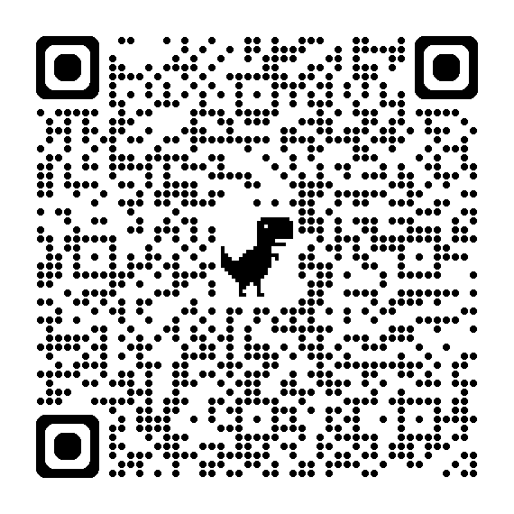
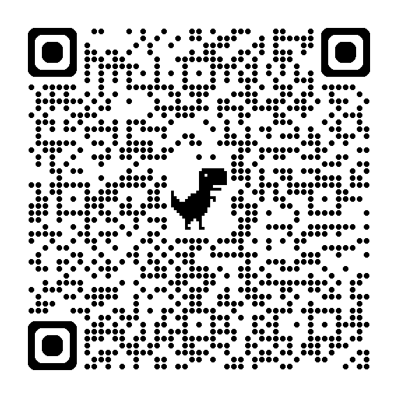
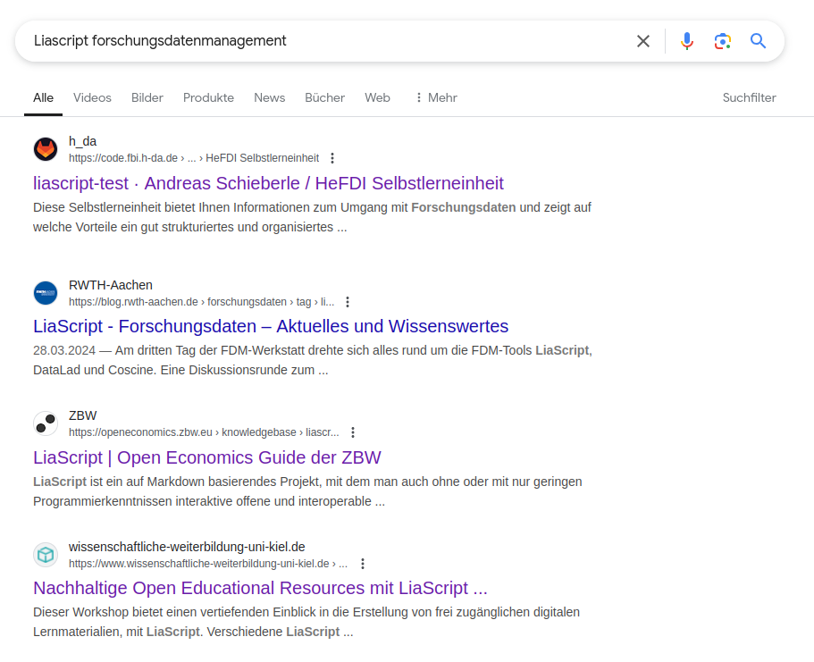

<!--

author:  Sebastian Zug; André Dietrich

language: de

narrator: Deutsch Female


@CSV
<script run-once style="display:block" modify="false">
async function csvToMarkdownTable(csvFile) {
  const response = await fetch(csvFile);
  const text = await response.text();
  const rows = Papa.parse(text).data;
  let markdownTable = "| " + rows[0].join(" | ") + " |\n"; // Header
  markdownTable += "| " + rows[0].map(() => "---").join(" | ") + " |\n"; // Separator
  for (let i = 1; i < rows.length; i++) {
    if (rows[i].length === rows[0].length) {
      markdownTable += "| " + rows[i].join(" | ") + " |\n";
    }
  }
  send.lia("LIASCRIPT: <!-- data-type='none' --" + ">" + markdownTable);
}
csvToMarkdownTable("@0")
"LIA: wait"
</script>
@end

@burn: <span class="burning-text">@0</span>

link:     style.css

script:   https://cdnjs.cloudflare.com/ajax/libs/PapaParse/5.4.1/papaparse.min.js
          https://cdn.jsdelivr.net/npm/@tensorflow/tfjs
          https://cdn.jsdelivr.net/npm/danfojs@1.1.2/lib/bundle.min.js
          https://cdn.jsdelivr.net/npm/echarts/dist/echarts.min.js

import:   https://raw.githubusercontent.com/LiaTemplates/LiveEdit-Embeddings/refs/tags/0.0.1/README.md

-->

[](https://liascript.github.io/course/?https://raw.githubusercontent.com/LiaPlayground/SLUB-2025/refs/heads/main/README.md#1)

# Lebendige Daten mit LiaScript

<h2>LiaScript Tutorial im Rahmen der _Love Data Week_ 2025</h2>

---------------------------------------

<div style="width: 36%; float: left">

<h5>
<p>Dr. Andre Dietrich, Dr. Ines Aubel, Prof. Dr. Sebastian Zug</p>
<p>TU Bergalakdemie Freiberg</p>
<p>Februar 2025</p>
</h5>

</div>

<!-- style="width: 40%; float: right" -->


## Warum LiaScript?

                        {{0-3}}
*******************************************************

> _"Another approach is to use a system like LiaScript [2], which enables the creation of __interactive online courses__ based on Markdown and JavaScript. It allows for embedding external elements including interactive elements, e.g. videos. The courses themselves can be developed in a decentralized way."_ 
>
> (Sebastian Speiser, "Composition of Open Educational Resources through Dynamic Linking of Modular Components", Proceedings of the 2024 16th International Conference on Education Technology and Computers)

*******************************************************

                        {{1-3}}
*******************************************************

> ... und was hat das mit Forschungsdatenmanagement zu tuen?


*******************************************************

                        {{1-2}}
*******************************************************


```ascii


| Aspekte des Forschungsdatenmanagements | Einsatz von LiaScript  |
|                                        | Lehre      | Anwendung |  
| -------------------------------------- | ---------- | --------- |
| 1. Datenmanagement & Speicherung       |    ┓       |           |
| 2. Metadaten & Dokumentation           |    ┃       |     ✅    |
| 3. Datenanalyse & Verarbeitung         |    ┃       |     ✅    |
| 4. Datenversionierung & Kollaboration  |    ┣ ✅    |           |
| 5. Datenpublikation & Open Science     |    ┃       |           |
| 6. Langzeitarchivierung                |    ┛       |           |                                             .

```

*******************************************************

                        {{2-3}}
*******************************************************

```ascii
                                                                              .-.
                                                                             ( 0 ) "__LiaScript als Konzept__"
| Aspekte des Forschungsdatenmanagements | Einsatz von LiaScript  |           .-.

|                                        | Lehre      | Anwendung |    .-.
| -------------------------------------- | ---------- | --------- |   ( 1 ) "__LiaScript Grundlagen__" 
| 1. Datenmanagement & Speicherung       |    ┓       |           |    .-.
| 2. Metadaten & Dokumentation           |    ┃       |     ✅  .-.
| 3. Datenanalyse & Verarbeitung         |    ┃       |     ✅ ( 2 ) "__LiaScript für die Datenanalyse__" 
| 4. Datenversionierung & Kollaboration  |    ┣ ✅    |         .-.
| 5. Datenpublikation & Open Science     |    ┃  .-.  |           |
| 6. Langzeitarchivierung                |    ┛ ( 3 ) "__LiaScript meets OER__"                                  .
                                                 .-.
 
```

*******************************************************

## 0. LiaScript als Konzept

                        {{0-1}}
*******************************************************

> __1. Wir trennen Darstellung und Inhalt! Alle Elemente werden soweit wie möglich durch eine rein textuelle Repräsentation ausgedrückt.__

```markdown @embed.style(height: 550px; min-width: 100%; border: 1px black solid)
# Vom Text zur Darstellung

__Text__

Hallo Welt!

__Mathematik__

$f(x) = x^2$

__Tabellen__

| X | B(y) | C(y) |
|---|:----:|:----:|
| 1 |   2  |   3  |
| 4 |   5  |   6  |

```

*******************************************************

                        {{1-2}}
*******************************************************

> __2. Lehre lebt von Interaktion__

```markdown @embed.style(height: 550px; min-width: 100%; border: 1px black solid)
# Lehre lebt von Interaktion

__Tabellen als Grafiken__

| X | B(y) | C(y) |
|---|:----:|:----:|
| 1 |   2  |   3  |
| 4 |   5  |   6  |

__Sprache__

> Click to run!
>
> {{|> Deutsch Female}}
> Markdown ist eine vereinfachte Auszeichnungssprache, die der Ausgangspunkt unserer Entwicklung von LiaScript war.

__Quizze__

Wann wurde die SLUB gegründet?

- [(X)] 1996
- [( )] 1896
```

*******************************************************

                        {{2-3}}
*******************************************************

> __3. Der Browser kann viel mehr als Webseiten anzuzeigen.__

````markdown @embed.style(height: 550px; min-width: 100%; border: 1px black solid)
<!--
import: https://raw.githubusercontent.com/liaTemplates/ABCjs/main/README.md
-->

# Browserfeatures / JavaScript

__Sprache__

> Click to run!
>
> {{|> Deutsch Female}}
> Markdown ist eine vereinfachte Auszeichnungssprache, die der Ausgangspunkt unserer Entwicklung von LiaScript war.

__Datenspeicherung__

``` abc  @ABCJS.render
X:353
T: GLUECK AUF DER STEIGER KOEMMT
N: E1512
O: Europa, Mitteleuropa, Deutschland
R: Staende -, Bergmanns - Lied
M: 4/4
L: 1/16
K: G
 | G8F4asdfasA4 | G8z8 |
B8A4c4 | B8z4
G2A2 | B4B4B4A2B2 | c4A3AA4
A2B2 | c4c4c4B2c2 | d4B3BB4
A4 | G8F8 | G4e4d4
c2A2 | B8A8 | G8z8
```
````

*******************************************************

## 1. LiaScript Tutorial

<!-- style="width: 40%; float: right" -->

https://liascript.github.io/LiveEditor/?/show/file/https://raw.githubusercontent.com/LiaPlayground/SLUB-2025/refs/heads/main/1.LiaScript_Tutorial.md


## 2. LiaScript in der Datenanalyse

<!-- style="width: 40%; float: right" -->

https://liascript.github.io/LiveEditor/?/show/file/https://raw.githubusercontent.com/LiaPlayground/SLUB-2025/refs/heads/main/2.LiaScript_Datenanalyse.md


## 3. LiaScript meets FDM & OER

{{0-1}}


{{1-2}}
| Autor_innen                                           | Titel &  | Link | Hinweise |
| ----------------------------------------------------- | ----- | ---- | -------- |
| Tim Bender, _Hessische Forschungsdateninfrastrukturen (HeFDI)_ |  [HeFDI-FDM-Selbstlerneinheit](https://liascript.github.io/course/?https://api.allorigins.win/raw?url=https://code.fbi.h-da.de/fbmd1715/hefdi-selbstlerneinheit/-/raw/main/de/01_einfuehrung_in_das_fdm.md?ref_type=heads#3)     | https://code.fbi.h-da.de/fbmd1715/hefdi-selbstlerneinheit     | Überzeugende Motivation anhand einer _FDM-Foto-Lovestory_         |
| Antje Ahrens, Nicola Seitz, Henrik Wagner, _C3L – Center für lebenslanges Lernen, Carl von Ossietzky Universität Oldenburg_ | [Universität Oldenburg, Research Data Management in the Energy Sector](https://www.twillo.de/edu-sharing/components/collections?id=cdaaa23c-4f8f-481f-bdad-19aad3bef880) |  https://github.com/NFDI4Energy/EFZN_rdm | Im August 2023 war dieser Kurs "Twillo edu-sharing Perle des Monats", Einbettung von H5P Elementen |
| Rose Hartmann, Joy Payton, _ARCUS Projekt, Children's Hospital of Philadelphia_ | [Data Education Courses](https://learn.arcus.chop.edu/) | https://github.com/arcus/education_modules | Grandioses Frontend für die Verwaltung der LiaScript-FDM-Kurse |

## Wie mache ich weiter?

| Ressource  | Hinweise |
| ------|-----|
| https://liascript.github.io | Projektwebseite  mit Links zu allen Informationen, LiveEditor, Blogbeiträgen, ... |
| [LiaScript erklärt LiaScript](https://liascript.github.io/course/?https://raw.githubusercontent.com/LiaScript/docs/master/README.md) | Dokumentation des Sprachumfanges |
| https://www.youtube.com/@liascript4180 | Youtube Kanal |
| https://github.com/orgs/LiaScript/discussions | Diskussionsforum von Nutzenden |
| Andre & Ines & Sebastian | Zum direkt ansprechen :-) |